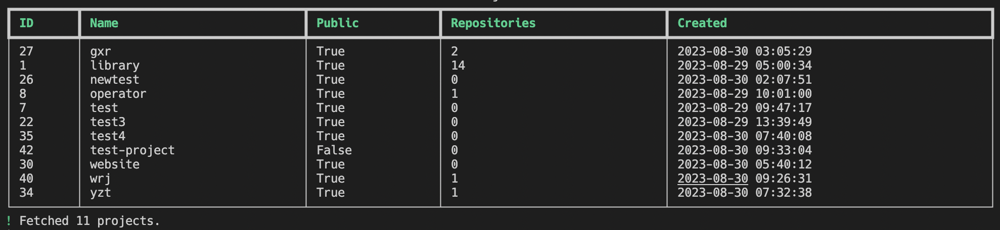
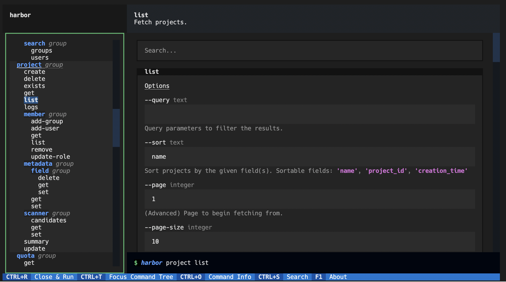
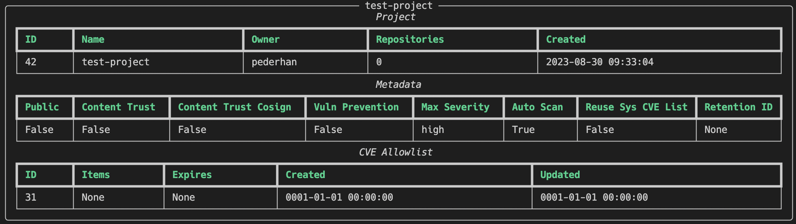
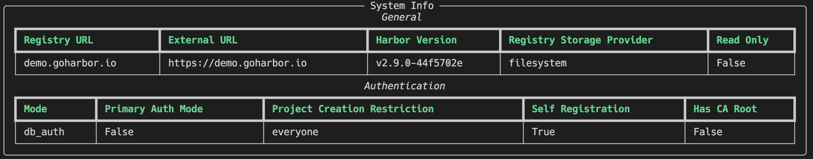
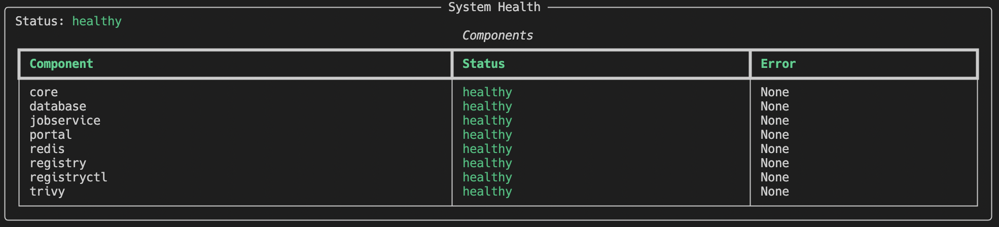

# harbor-cli

<!-- [](https://pypi.org/project/harbor-cli)
[](https://pypi.org/project/harbor-cli) -->

-----

**NOTE**: This project is still in early development, and most functionality, such as CLI options and configuration file format, is subject to change. Prior to version 1.0.0, breaking changes may be introduced in minor version updates.

**Table of Contents**

- [Installation](#installation)
- [Features](#features)
- [Usage](#usage)
- [Examples](#examples)
- [License](#license)

## Installation

<!-- ```console
pip install harbor-cli
``` -->

The name `harbor-cli` is in the process of being acquired from its current owner on PyPI.

In the meantime, you can install the package from GitHub, preferably with `pipx`:

```
pipx install git+https://github.com/pederhan/harbor-cli
```

Before the name acquisition process is complete, semantic versioning will not be adhered to and breaking changes may be introduced at any point. Once the package is available on PyPI, semantic versioning will be adhered to and breaking changes will only be introduced in major version updates.

## Features

- [150+ commands](https://pederhan.github.io/harbor-cli/commands/)
- Beautiful command-line interface powered by [Typer](https://github.com/tiangolo/typer) and [Rich](https://github.com/Textualize/rich).
- REPL mode (`harbor repl`)
- Tab completion for commands and options.
- Automatic retrying of failed requests
- Multiple output formats:
    - Table
    - JSON
- Large number of configuration options
    - Authentication methods
    - Table styling
    - Output formats
    - ... and more


## Usage


Installing the application puts `harbor` in your `PATH`, and can be invoked by typing `harbor` in your terminal:

```console
$ harbor --help
```

<!-- Cut before here -->

### Quick Start 🚀


**1. Initialize configuration**

```
harbor init
```

After creating the configuration file, the application can be run in any of the following modes:

**2a. Run commands directly**

```
harbor <command>
```



**2b. REPL mode**

```
harbor repl
```


**2c. TUI mode**

```
harbor tui
```



## Examples

Most commands produce some sort of table. While the most common methods have nice hand-written tables, some of the tables are generated automatically from the data returned by the API.

PRs are always welcome if you wish to add a new table or improve an existing one.

### Create project

```
harbor project create
```


### Update project


```
harbor project update test-project --public false --severity high --auto-scan true
```

### Get project

```
harbor project get test-project
```



### Get project (JSON format)

```
harbor --format json project get test-project
```


### System info

```
harbor system info
```

<!-- All examples are running with COLUMNS=140. -->



### System health

```
harbor system health
```



## License

`harbor-cli` is distributed under the terms of the [MIT](https://spdx.org/licenses/MIT.html) license.
