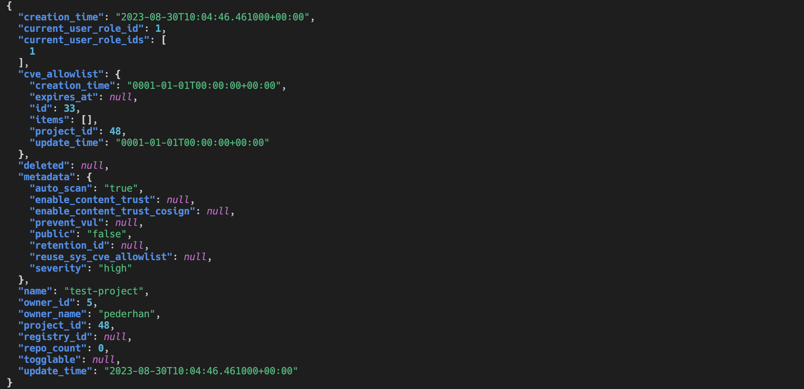

# harbor-cli

<!-- [](https://pypi.org/project/harbor-cli)
[](https://pypi.org/project/harbor-cli) -->

 [](https://pederhan.github.io/harbor-cli/)  


-----

**Table of Contents**

- [Features](#features)
- [Installation](#installation)
  - [MacOS](#macos)
  - [Linux](#linux)
  - [Windows](#windows)
- [Documentation](#documentation)
- [Usage](#usage)
  - [Quick Start](#quick-start-)
- [Examples](#examples)
- [License](#license)

## Features

- [150+ commands](https://pederhan.github.io/harbor-cli/commands/)
- Beautiful command-line interface powered by [Typer](https://github.com/tiangolo/typer) and [Rich](https://github.com/Textualize/rich).
- REPL mode (`harbor repl`)
- TUI mode (`harbor tui`)
- Tab completion for commands and options.
- Automatic retrying of failed requests
- Multiple output formats:
    - Table
    - JSON
- Large number of configuration options
    - Authentication methods
    - Table styling
    - Output formats
    - ... and more


## Installation

It is highly recommended to install `harbor-cli` with [pipx](https://pipx.pypa.io/stable/). pipx installs the application in an isolated environment to avoid dependency conflicts, and makes it easy to upgrade or uninstall it afterwards.

### MacOS

Install as a pipx app:

```
pipx install harbor-cli
```

or through Homebrew:

```
brew tap add pederhan/harbor-cli
brew install harbor-cli
```

Keyring functionality should work out of the box on MacOS >=11 with Python >=3.8.7.


### Linux


```
pipx install harbor-cli
```

Depending on your Linux flavor and choice of keyring backend, you may need to install additional packages to enable keyring functionality. See the [keyring documentation](https://keyring.readthedocs.io/en/latest/#installing-keyring) for more information.


If you need to inject a package into the application's pipx environment, use the `pipx inject` command:


```
pipx inject harbor-cli <package to inject>
```


### Windows

```
pipx install harbor-cli
```

Keyring functionality is untested on Windows, but should work out of the box. If you run into any issues, consult the [keyring documentation](https://github.com/jaraco/keyring#readme) for more information. Otherwise, please open an issue.


## Documentation

Documentation can be found [here](https://pederhan.github.io/harbor-cli/).

The documentation includes extensive setup and usage guides, as well as a list of all commands and their options.

## Usage


Installing the application puts `harbor` in your `PATH`, and can be invoked by typing `harbor` in your terminal:

```console
$ harbor --help
```


<!-- Cut before here -->

### Quick Start 🚀


**1. Initialize configuration**

```
harbor init
```

After completing the configuration wizard, the application can be run in any of the following modes:

**2a. Run commands directly**

```
harbor <command>
```


**2b. REPL mode**

```
harbor repl
```


**2c. TUI mode**

```
harbor tui
```


## Examples

Most commands produce some sort of table. While the most common methods have nice hand-written tables, some of the tables are generated automatically from the data returned by the API.

PRs are always welcome if you wish to add a new table or improve an existing one.

### Create project

```
harbor project create
```


### Update project


```
harbor project update test-project --public false --severity high --auto-scan true
```

### Get project

```
harbor project get test-project
```


### Get project (JSON format)

```
harbor --format json project get test-project
```



### System info

```
harbor system info
```

<!-- All examples are running with COLUMNS=140. -->


### System health

```
harbor system health
```


## License

`harbor-cli` is distributed under the terms of the [MIT](https://spdx.org/licenses/MIT.html) license.
